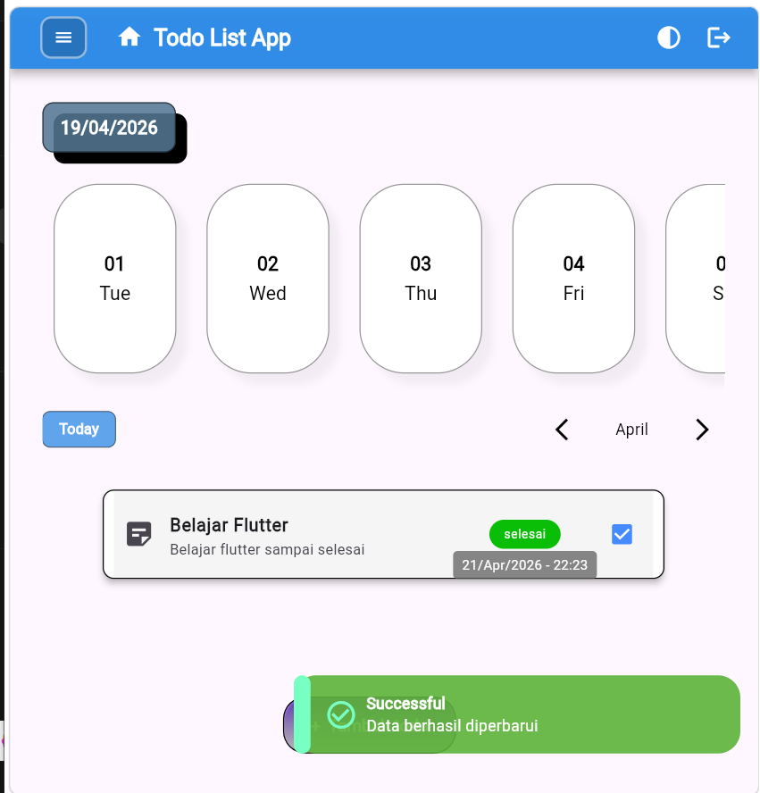
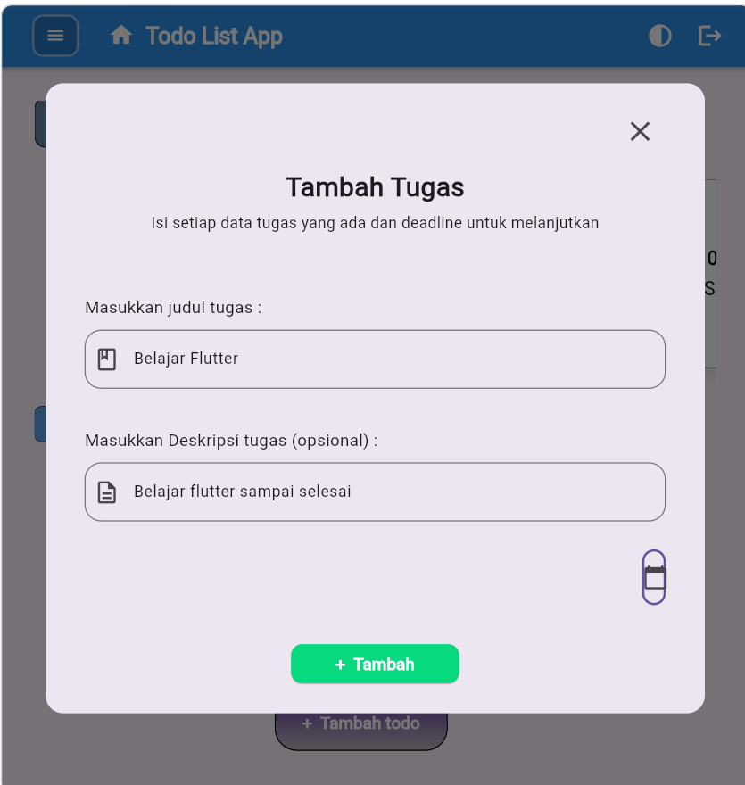
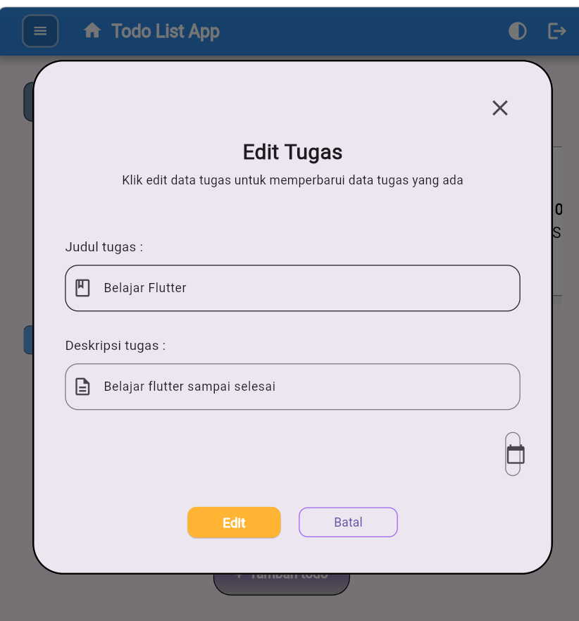

# ✅ TodoList App — Flutter × Supabase

Selamat datang di **TodoList App** sederhana yang dibangun dengan arsitektur terstruktur (Domain–Data–Presentation), state management BLoC/Cubit, dan backend **Supabase**.

Project ini fokus pada kebutuhan inti manajemen tugas harian: tambah, lihat, update status, edit data task, hapus task, serta pengelompokan berdasarkan tanggal.

---

## 🚀 Tech Stack

- **Framework**: Flutter
- **Language**: Dart
- **Backend as a Service**: Supabase
- **State Management**: `flutter_bloc` (Cubit)
- **Network / HTTP**: `dio`
- **Environment Management**: `flutter_dotenv`
- **UI Utilities**: `flutter_slidable`, `motion_toast`, `intl`
- **Utility**: `uuid`

---

## ✨ Fitur Utama

- Menampilkan daftar todos dari database Supabase.
- Menambahkan todo baru (judul, deskripsi, deadline).
- Mengubah status todo (checked / unchecked).
- Mengupdate seluruh data todo.
- Menghapus todo.
- Navigasi tanggal per bulan (prev/next/current month).
- Menampilkan feedback aksi (toast sukses / loading / error state).

---

## 🧩 Struktur Model (Domain & Data Layer)

Berikut ringkasan struktur berdasarkan folder `lib/features/todos/domain` dan `lib/features/todos/data`:

```bash
lib/features/todos/
├── domain/
│   ├── entities/
│   │   └── todos.dart
│   ├── repositories/
│   │   └── todos_repository.dart
│   └── use_cases/
│       ├── add_todos_use_case.dart
│       ├── del_todos_use_case.dart
│       ├── get_all_dates_in_year_use_case.dart
│       ├── get_keterangan_waktu_use_case.dart
│       ├── get_todos.dart
│       ├── update_all_data_todos_use_case.dart
│       └── update_todos_use_case.dart
└── data/
		├── data_sources/
		│   ├── todos_remote_data_source.dart
		│   └── todos_remote_data_source_impl.dart
		├── models/
		│   └── todos_model.dart
		└── repositories/
				└── todos_repository_impl.dart
```

### Penjelasan Singkat

- **Entity (`Todos`)**
	- Representasi data inti todo: `id`, `title`, `description`, `isChecked`, `createdAt`, `deadline`.

- **Repository Contract (`TodosRepository`)**
	- Kontrak domain untuk operasi todo: get, add, update status, update data, delete.

- **Use Cases**
	- Memisahkan tiap aksi bisnis agar mudah dipelihara & dites (contoh: `GetTodos`, `AddTodosUseCase`, `UpdateTodosUseCase`, dll).

- **Model (`TodosModel`)**
	- Turunan dari entity, dengan mapper `fromMap()` dan `toMap()` untuk integrasi data Supabase.

- **Repository Implementation (`TodosRepositoryImpl`)**
	- Implementasi konkret operasi CRUD terhadap tabel `todos` di Supabase.

---

## 🖼️ Showcase / Tangkapan Layar


- Home / Todo List

	|  |  |
	| --- | --- |
	|  | .png) |

- Tambah Todo
	
- Edit / Update Todo
	


---

## ⚙️ Cara Instalasi

### 1) Clone repository

```bash
git clone https://github.com/Frzz-02/TodoList_app-By-Flutter-and-Supabase.git
cd TodoList_app-By-Flutter-and-Supabase
```

### 2) Install dependencies

```bash
flutter pub get
```

### 3) Siapkan environment file

Buat file `assets/.env` lalu isi:

```env
SUPABASE_URL=your_supabase_url
SUPABASE_ANON_KEY=your_supabase_anon_key
```

### 4) Pastikan tabel `todos` di Supabase memiliki kolom minimal:

- `id` (text/uuid)
- `title` (text)
- `description` (text)
- `is_checked` (bool)
- `created_at` (timestamp)
- `deadline` (timestamp)

### 5) Jalankan aplikasi

```bash
flutter run
```

---

## 🤝 Penutup

Project ini dibuat sebagai aplikasi Todo sederhana untuk latihan implementasi arsitektur Flutter yang rapi, integrasi Supabase, dan state management menggunakan BLoC/Cubit.

Kalau kamu suka project ini, silakan ⭐ repo-nya dan gunakan sebagai fondasi untuk pengembangan fitur lanjutan.

---

## 📬 Contact

- GitHub: [@Frzz-02](https://github.com/Frzz-02)
- Email: `pc.feriirawan0211@gmail.com`